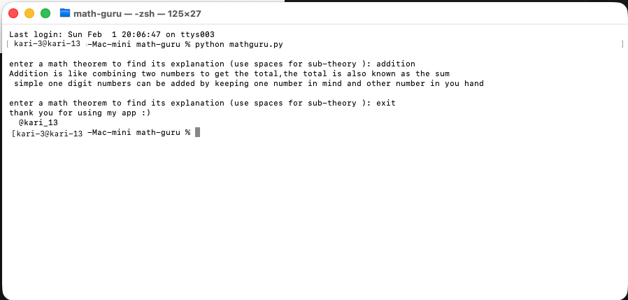

# math-guru
## this is a simple app to give explanation of math theorems of middle school
this is still too underdeveloped any new ideas are welcomed
this program uses python , and it's json module 

if you know in json , try to add new theorems 

**note : please make sure that the python and json file is in same folder for correct execution**
